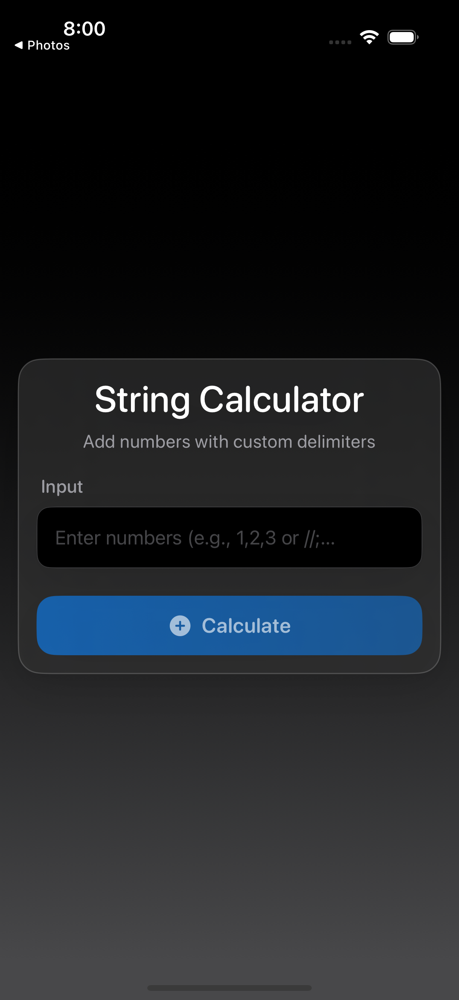
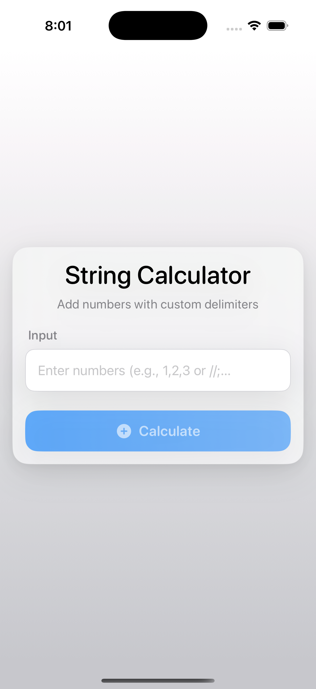
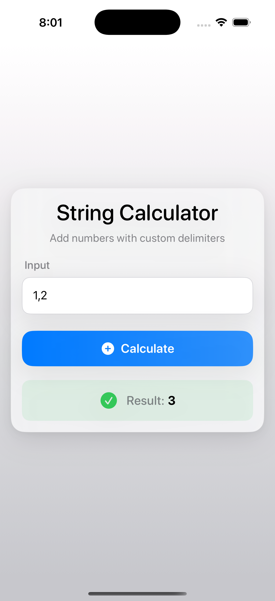
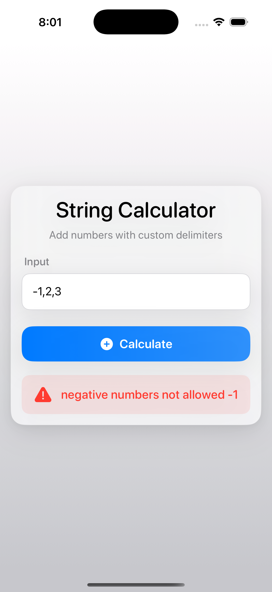
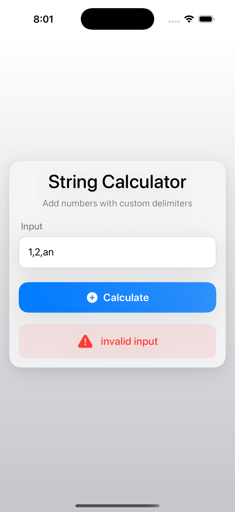

# String Calculator

This repository contains a implementation of String Calculator Kata using TDD in Swift and a UI interface to interact.

## Test Driven Development(TDD)
The project follows TDD principles, ensuring that tests are written before the actual code implementation. This helps in maintaining high code quality and reducing bugs.

## Requirements

- iOS 16.0+
- XCode 14.0+
- Swift 5

## Installation

1. Clone the repository:
```bash
git clone https://github.com/udayg24/String-Calculator.git
cd String-Calculator
```

2. Open the project in XCode:
```bash
xed .
```

3. Build and run the project (⌘+R)

## Testing

Run the tests:
```bash
# In XCode: ⌘+U
# via command line:
xcodebuild test -scheme "String Calculator" -destination "platform=iOS Simulator,name=iPhone 16 Pro"
```

## Screenshots

- Adaptive for both Light and Dark Modes

<table>
<tr>
<td></td>
<td></td>
</tr>
<tr>
<td align="center"><b>Dark Mode</b></td>
<td align="center"><b>Light Mode</b></td>
</tr>
</table>

- Functionality

<table>
<tr>
<td></td>
<td></td>
<td></td>
</tr>
<tr>
<td align="center"><b>Valid Input</b></td>
<td align="center"><b>Negative Input</b></td>
<td align="center"><b>Invalid Input</b></td>
</tr>
</table>


